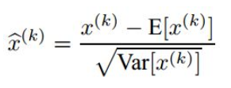
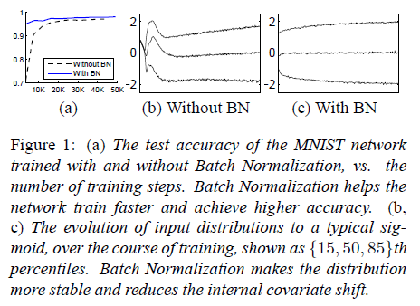

# Batch Normalization: Accelerating Deep Network Training by Reducing Internal Covariate Shift

## Motivation
作者认为：网络训练过程中参数不断改变导致后续每一层输入的分布也发生变化，而学习的过程又要使每一层适应输入的分布，因此我们不得不降低学习率、小心地初始化。作者将分布发生变化称之为 **internal covariate shift**。

大家应该都知道，我们一般在训练网络的时会将输入减去均值，还有些人甚至会对输入做白化等操作，目的是为了加快训练。为什么减均值、白化可以加快训练呢，这里做一个简单地说明：

首先，图像数据是高度相关的，假设其分布如下图a所示(简化为2维)。
 

由于初始化的时候，我们的参数一般都是0均值的，因此开始的拟合y=Wx+b，基本过原点附近，如图b红色虚线。因此，网络需要经过多次学习才能逐步达到如紫色实线的拟合，即收敛的比较慢。如果我们对输入数据先作减均值操作，如图c，显然可以加快学习。更进一步的，我们对数据再进行去相关操作，使得数据更加容易区分，这样又会加快训练，如图d。 

**白化**的方式有好几种，常用的有**PCA白化**：即对数据进行PCA操作之后，在进行方差归一化。这样数据基本满足0均值、单位方差、弱相关性。作者首先考虑，对每一层数据都使用白化操作，但分析认为这是不可取的。因为白化需要计算**协方差矩阵、求逆**等操作，计算量很大，此外，反向传播时，**白化操作不一定可导**。于是，作者采用下面的Normalization方法。

## Normalization via Mini-Batch Statistics
数据归一化方法很简单，就是要让数据具有**0均值和单位方差**，如下式：

但是作者又说如果简单的这么干，会降低层的表达能力。比如下图，

在使用sigmoid激活函数的时候，如果把数据限制到0均值单位方差，那么相当于只使用了激活函数中近似线性的部分，这显然会降低模型表达能力，如下图。（个人以为有待商榷，毕竟激活函数的输入是经过线性变换的）为此，作者又为BN增加了2个参数，用来保持模型的表达能力。 
于是最后的输出为：

上述公式中用到了均值E和方差Var，需要注意的是理想情况下E和Var应该是针对整个数据集的，但显然这是不现实的。因此，作者做了简化，用一个**Batch的均值和方差作为对整个数据集均值和方差的估计**。 
整个BN的算法如下：

## Training and Inference with Batch-Normalized Networks
整个训练和测试的过程如下：

从上面可以看出，在测试阶段，计算均值和方差的时候用的是整体的均值和方差，用样本的均值和方差做无偏估计得到。

## Batch Normalization enables higher learning rates
在传统的深度网络中，太大的学习率会使得梯度爆炸或者弥散。加入batch_normalization后，能有效的阻止激活函数进入饱和区域，进而减少梯度弥散的情况。

## Batch Normalization regularizes the model
在训练的时候，BN使用了整个batch中数据的信息来对每一个输入数据做处理，这本身就是一种regularizer，所以在训练的时候可以考虑不要DropOut或者减少力度。

## Experiments
作者在文章中也做了很多实验对比，我这里就简单说明2个。

 

下图a说明，BN可以加速训练。图b和c则分别展示了训练过程中输入数据分布的变化情况。 

### 使用BN的好处
1. 加大学习率，从而加快训练。
2. 不需要DropOut。
3. 不需要L2正则。
4. 不需要LRN。

### 实验结果

 

