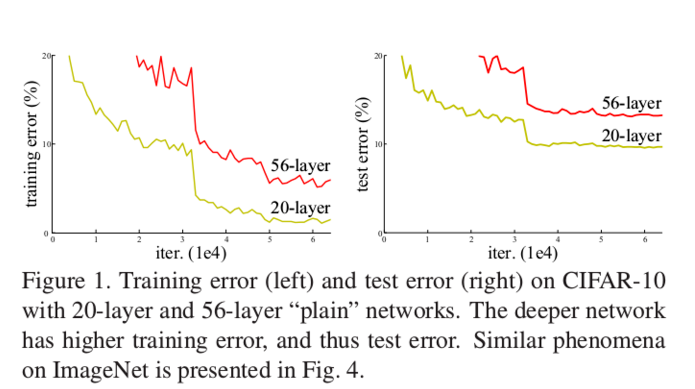
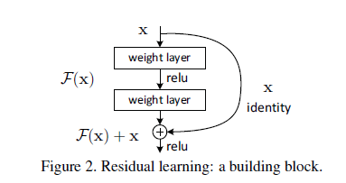
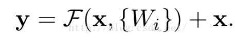
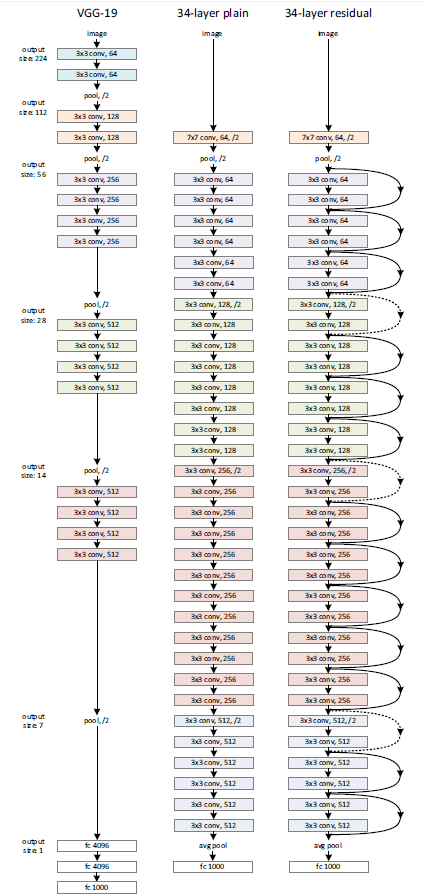
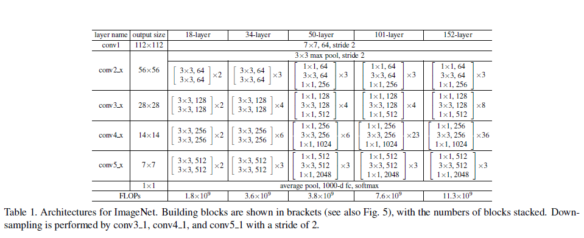
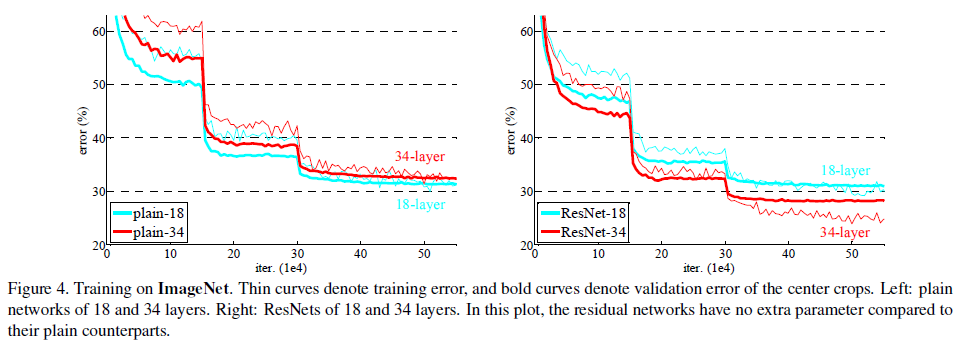
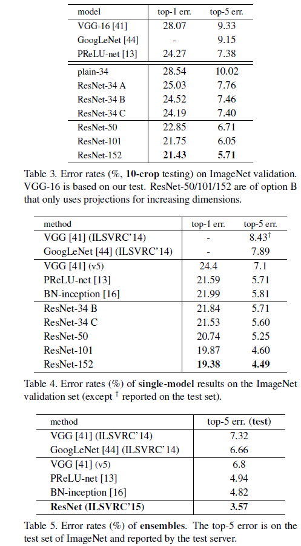

# Deep Residual Learning for Image Recognition

## Abstract
更深的神经网络往往更难以训练，我们在此提出一个残差学习的框架，以减轻网络的训练负担，这是个比以往的网络要深的多的网络。我们明确地将层作为输入学习残差函数，而不是学习未知的函数。我们提供了非常全面的实验数据来证明，残差网络更容易被优化，并且可以在深度增加的情况下让精度也增加。

## Introduction
在图像分类中，往往要求神经网络需要比较深以达到好的效果，然而，随着网络层数的增加，梯度消失/爆炸的问题阻碍了模型的收敛。当然，可以通过标准的初始化和正则化层来基本解决解决梯度消失/爆炸的问题。然而随着神经网络深度的增加，却出现了精确度饱和的问题，而且会迅速的变差。

如上图所示，这个问题的出现并不是因为过拟合导致的，因为可以看到的是56层的神经网络的训练误差也比浅层模型(20层)的神经网络要差。

这个实验结果让人一脸懵逼，直观上考虑两个神经网络，一个是浅层的神经网络，比如说20层，另一个与之对应的深层神经网络为56层，照理来说，56层的神经网络只要前面20层保持与浅层一样，后面36层，每层都做一个Indentity映射，这样就能保证训练误差不比20层的差。

为了解决上面的问题，文章提出了新的网络结构：deep residual learning framework，如下图所示：

一个残差快有二层(实验证明，这个残差块往往需要两层以上，单单一层的残差块并不能起到提升作用)，如下表达式，其中σ代表非线性函数ReLU

当需要对输入和输出维数进行变化时（如改变通道数目），可以在shortcut时对x做一个线性变换Ws，如下式，然而实验证明x已经足够了，不需要再搞个维度变换，除非需求是某个特定维度的输出。

假设H(X)来表示最优非线性映射，我们认为与此对应的残差F（X）= H(X) - X 是网络更加容易学习的。极端情况下，如果Identity映射是最优解，那么相比于让一个非线性层去逼近Identity映射，让残差等于0是更加容易的。

## Deep Residual Learning

残差网络设计如下：

最左边的是普通的VGG-19，中间的为VGG-34,最右边的为与之对应的残差网络。在简单的VGG-34基础上，我们插入了快捷连接，将网络转化为其对应的残差版本。当输入输出是相同尺寸的时候，没有任何问题。当输入输出尺寸发生变化时（上图虚线的快捷连接），我们考虑两个策略：

1. 仍然使用自身映射，对于维度的增加用零来填补空缺。此策略不会引入额外的参数;
2. 1×1的卷积完成;

# Experiments

实验的网络结果如下图所示：

实验结果如下：

