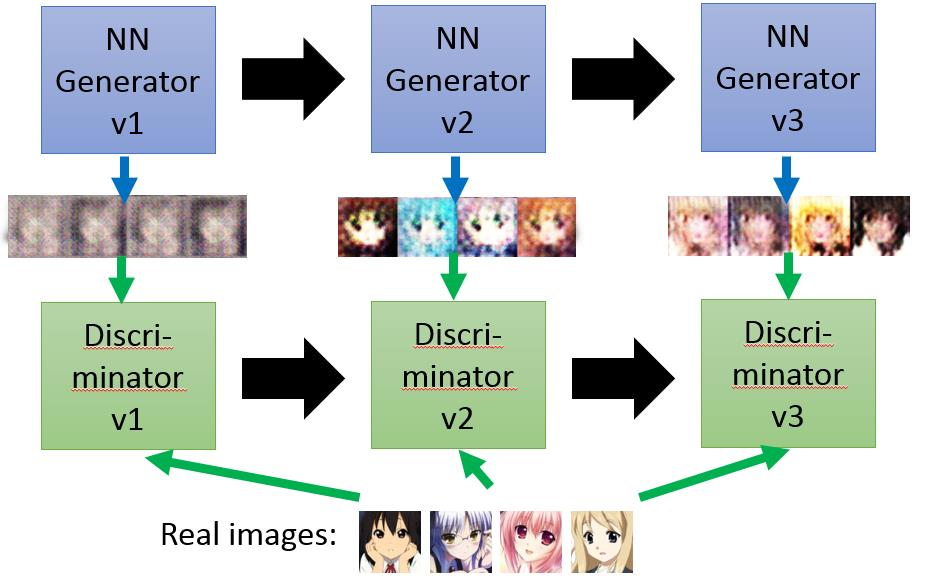
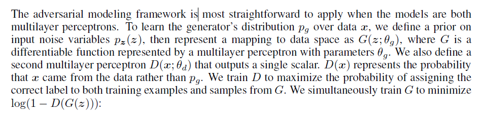
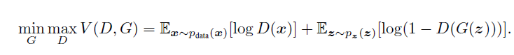
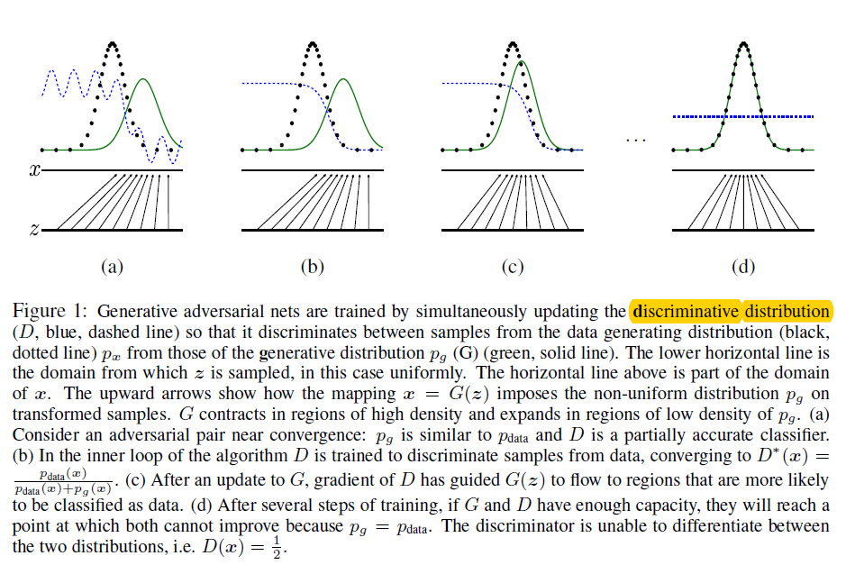
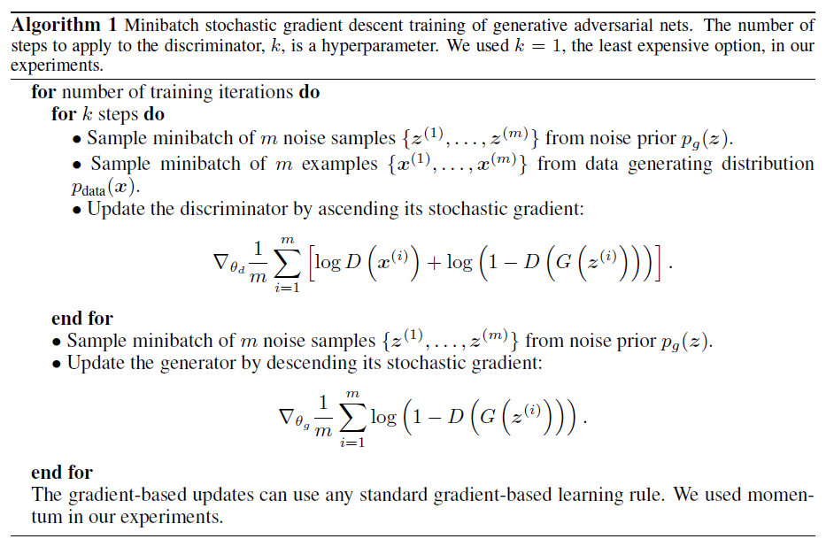
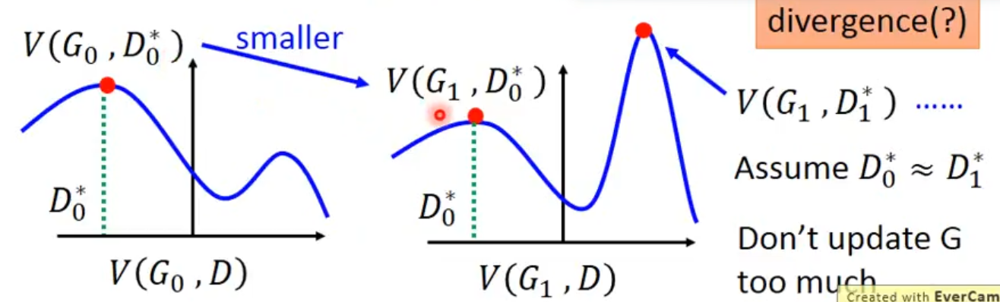
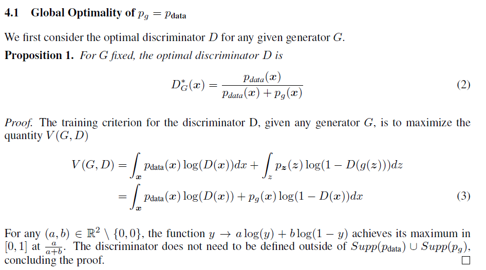
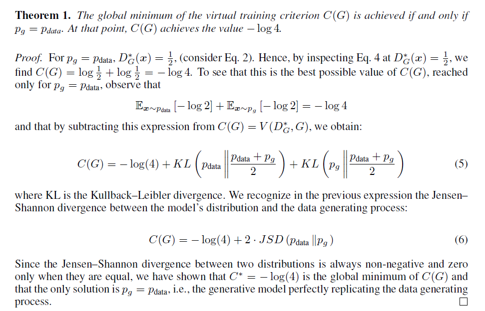

# Generative Adversarial Nets

## Introduction
作何提出了一个通过对抗过程估计生成模型的新框架，在新框架中我们同时训练两个模型：一个用来捕获数据分布的生成模型G，和一个用来估计样本来自训练数据而不是G的概率的判别模型D，G的训练过程是最大化D产生错误的概率。这个框架相当于一个极小化极大的双方博弈。在任意函数G 和D 的空间中存在唯一的解，其中G恢复训练数据分布，并且D处处都等于1/2。具体的G、D训练过程如下图所示

## Adversarial nets

解释：

1. 之所以把G的输出x成为一个分布，是因为G的输入z是一个概率分布。

2. G的输出x的分布是收到定义G的网络的参数控制

3. D的目标就是区分x是来自于数据原始分布，还是由G产生

如果把来自于原始分布的数据标位lable 1，把来源于G产生的数据标位label 0，那么D可以用一个简单的logistic regression即可，那么目标函数也就非常的熟悉，如下所示：
 

目标函数既定，且网络结构也定的情况下，采取合适的优化算法即可训练网络，训练结果如下所示：

注意：在训练G的时候，由于1开始D很强大，所以D(G(z))基本都等于0，那么导致log(1-D)就是出于饱和的状态，即梯度非常的小，为了解决这个问题，在实际训练中，目标函数并不是log(1-D)而改成-log(D),这两个函数的单调性一致，不同的是，后者在D接近于0的时候梯度较大，训练会比较有效。

## Theoretical Results
训练算法如下：

注意:这里在训练D的时候，并没有取到对应G的optimal D*，原因如下：

如果每次都找到D*，那么确实能保证V(G1，D0*)比V(G0，D0*)小，但是在第二轮训练D的时候，很有可能V(G1，D1*)比V(G1，D0*)还大。

结论：

