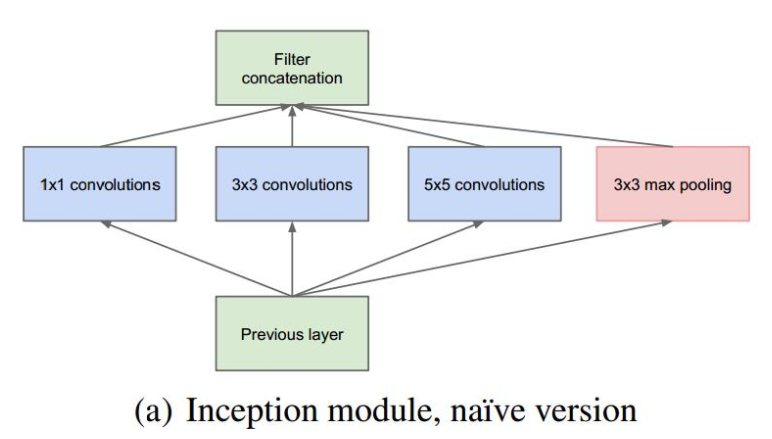
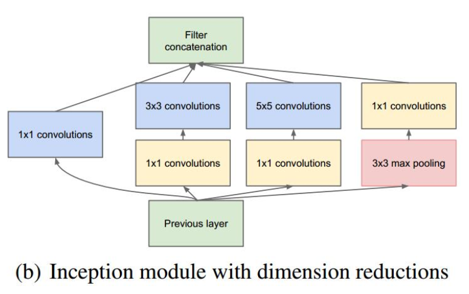
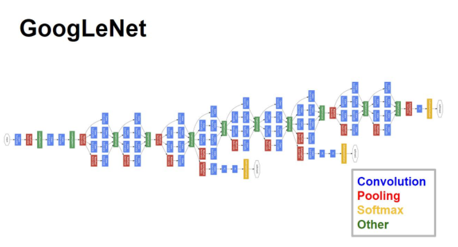

# VERY DEEP CONVOLUTIONAL NETWORKS

## Abstract

本篇论文我们提出一种由Inception架构而成的深度卷积神经网络，在ImageNet Large-Scale Visual Recognition Challenge 2014上分类和检测上都取得了最好的效果。Inception这种架构最大的优点在于剑圣了网络的计算开销。通过精心的设计，我们在增加了网络的深度和宽度的同时，保持计算量不变。

## Introduction
深度学习以及神经网络快速发展，人们不再只关注更给力的硬件、更大的数据集、更大的模型，而是更在意新的idea、新的算法以及模型的改进。

一般来说，提升网络性能最直接的办法就是增加网络深度和宽度，这也就意味着巨量的参数。但是，巨量参数**容易产生过拟合**，也会大大**增加计算量**。

文章认为解决上述两个缺点的根本方法是将全连接甚至一般的卷积都转化为稀疏连接。早些的时候，为了打破网络对称性和提高学习能力，传统的网络都使用了随机稀疏连接。但是，计算机软硬件对非均匀稀疏数据的计算效率很差，所以在AlexNet中又重新启用了全连接层，目的是为了更好地优化并行运算。所以，现在的问题是有没有一种方法，既能**保持网络结构的稀疏性**，又能利用**密集矩阵的高计算性能**。大量的文献表明可以将稀疏矩阵聚类为较为密集的子矩阵来提高计算性能，据此论文提出了名为Inception的结构来实现此目的。

## Architectural Details
Inception 结构的主要思路是怎样用密集成分来近似最优的局部稀疏结构。 
作者首先提出下图这样的基本结构：

对上图做以下说明： 
1. 采用不同大小的卷积核意味着不同大小的感受野，最后拼接意味着不同尺度特征的融合。
2. 之所以卷积核大小采用1、3和5，主要是为了方便对齐。设定卷积步长stride=1之后，只要分别设定pad=0、1、2，那么卷积之后便可以得到相同维度的特征，然后这些特征就可以直接拼接在一起了。
3. 文章说很多地方都表明pooling挺有效，所以Inception里面也嵌入了。
4. 网络越到后面，特征越抽象，而且每个特征所涉及的感受野也更大了，因此随着层数的增加，3x3和5x5卷积的比例也要增加

**但是，使用5x5的卷积核仍然会带来巨大的计算量**。 为此，文章借鉴NIN2，采用1x1卷积核来进行降维。 
例如：上一层的输出为100x100x128，经过具有256个输出的5x5卷积层之后(stride=1，pad=2)，输出数据为100x100x256。其中，卷积层的参数为128x5x5x256。假如上一层输出先经过具有32个输出的1x1卷积层，再经过具有256个输出的5x5卷积层，那么最终的输出数据仍为为100x100x256，但卷积参数量已经减少为128x1x1x32 + 32x5x5x256，大约减少了4倍。

改进后的Inception Module如下图：

## GoogLeNet
根据Inception的架构，作者提出了新的卷积神经网络叫做GoogLeNet。结果如下图所示：

对上图做如下说明：

1. 显然GoogLeNet采用了模块化的结构，方便增添和修改； 
2. 网络最后采用了average pooling来代替全连接层，想法来自NIN,事实证明可以将TOP1 accuracy提高0.6%。但是，实际在最后还是加了一个全连接层，主要是为了方便以后大家finetune；
3. 虽然移除了全连接，但是网络中依然使用了Dropout;
4. 为了避免梯度消失，网络额外增加了2个辅助的softmax用于向前传导梯度。文章中说这两个辅助的分类器的loss应该加一个衰减系数，但看caffe中的model也没有加任何衰减。此外，实际测试的时候，这两个额外的softmax会被去掉。

## Conclusion
GoogLeNet是谷歌团队为了参加ILSVRC 2014比赛而精心准备的，为了达到最佳的性能，除了使用上述的网络结构外，还做了大量的辅助工作：包括训练多个model求平均、裁剪不同尺度的图像做多次验证等等。详细的这些可以参看文章的实验部分。

本文的主要想法其实是想通过构建密集的块结构来近似最优的稀疏结构，从而达到提高性能而又不大量增加计算量的目的。GoogleNet的caffemodel大小约50M，但性能却很优异。