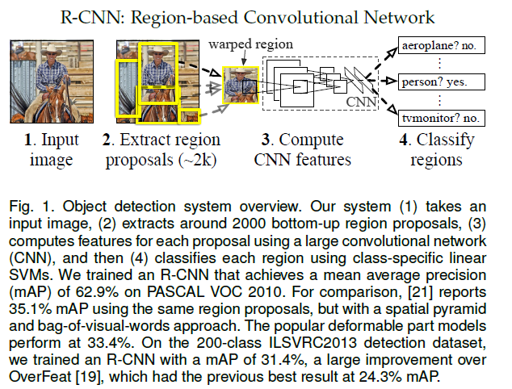
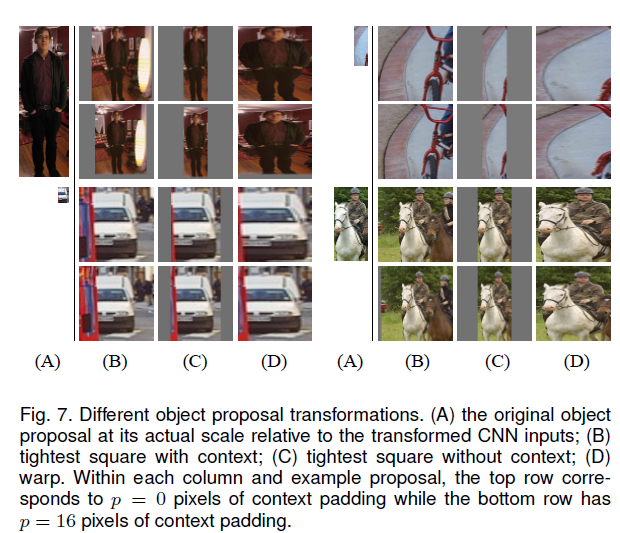

# Region-based Convolutional Networks for Accurate Object Detection and Segmentation

## Introduction
物体检测和图片分类的区别：图片分类不需要定位，而物体检测需要定位出物体的位置，也就是相当于把物体的bbox检测出来，还有一点物体检测是要把所有图片中的物体都识别定位出来。

## Object Detection with RCNN

物体检测需要定位出物体的位置，这种就相当于回归问题，求解一个包含物体的方框，这种方法对于单物体检测还不错，但是对于多物体检测就……

因此paper采用的方法是：首先输入一张图片，我们先定位出2000个物体候选框(Selective Search算法等)，然后采用CNN提取每个候选框中图片的特征向量，特征向量的维度为4096维，接着采用svm算法对各个候选框中的物体进行分类识别。也就是总个过程分为三个程序：a、找出候选框；b、利用CNN提取特征向量；c、利用SVM进行特征向量分类。具体的流程如下图片所示：

### Region proposals

当我们输入一张图片时，我们要搜索出所有可能是物体的区域，这个采用的方法是传统文献的算法：《search for object recognition》，通过这个算法我们搜索出2000个候选框。然后从上面的总流程图中可以看到，搜出的候选框是矩形的，而且是大小各不相同。然而CNN对输入图片的大小是有固定的，如果把搜索到的矩形选框不做处理，就扔进CNN中，肯定不行。因此对于每个输入的候选框都需要缩放到固定的大小。下面我们讲解要怎么进行缩放处理，为了简单起见我们假设下一阶段CNN所需要的输入图片大小是个正方形图片227*227。因为我们经过selective search 得到的是矩形框，paper试验了两种不同的处理方法：

1. 各向异性缩放

	这种方法很简单，就是不管图片的长宽比例，管它是否扭曲，进行缩放就是了，全部缩放到CNN输入的大小227*227，如下图(D)所示；

2. 各向同性缩放

	因为图片扭曲后，估计会对后续CNN的训练精度有影响，于是作者也测试了“各向同性缩放”方案。这个有两种办法
	- 直接在原始图片中，把bounding box的边界进行扩展延伸成正方形，然后再进行裁剪；如果已经延伸到了原始图片的外边界，那么就用bounding box中的颜色均值填充；如下图(B)所示;
	- 先把bounding box图片裁剪出来，然后用固定的背景颜色填充成正方形图片(背景颜色也是采用bounding box的像素颜色均值),如下图(C)所示; 

对于上面的异性、同性缩放，文献还有个padding处理，上面的示意图中第1、3行就是结合了padding=0,第2、4行结果图采用padding=16的结果。经过最后的试验，作者发现采用各向异性缩放、padding=16的精度最高，具体不再啰嗦。

OK，上面处理完后，可以得到指定大小的图片，因为我们后面还要继续用这2000个候选框图片，继续训练CNN、SVM。然而人工标注的数据一张图片中就只标注了正确的bounding box，我们搜索出来的2000个矩形框也不可能会出现一个与人工标注完全匹配的候选框。因此我们需要用IOU为2000个bounding box打标签，以便下一步CNN训练使用。在CNN阶段，如果用selective search挑选出来的候选框与物体的人工标注矩形框的重叠区域IoU大于0.5，那么我们就把这个候选框标注成物体类别，否则我们就把它当做背景类别。

## Training

a、网络结构设计阶段

网络架构我们有两个可选方案：第一选择经典的Alexnet；第二选择VGG16。经过测试Alexnet精度为58.5%，VGG16精度为66%。VGG这个模型的特点是选择比较小的卷积核、选择较小的跨步，这个网络的精度高，不过计算量是Alexnet的7倍。后面为了简单起见，我们就直接选用Alexnet，并进行讲解；Alexnet特征提取部分包含了5个卷积层、2个全连接层，在Alexnet中p5层神经元个数为9216、 f6、f7的神经元个数都是4096，通过这个网络训练完毕后，最后提取特征每个输入候选框图片都能得到一个4096维的特征向量。

b、网络有监督预训练阶段

参数初始化部分：物体检测的一个难点在于，物体标签训练数据少，如果要直接采用随机初始化CNN参数的方法，那么目前的训练数据量是远远不够的。这种情况下，最好的是采用某些方法，把参数初始化了，然后在进行有监督的参数微调，这边文献采用的是有监督的预训练。所以paper在设计网络结构的时候，是直接用Alexnet的网络，然后连参数也是直接采用它的参数，作为初始的参数值，然后再fine-tuning训练。

网络优化求解：采用随机梯度下降法，学习速率大小为0.001；

C、fine-tuning阶段

我们接着采用selective search 搜索出来的候选框，然后处理到指定大小图片，继续对上面预训练的cnn模型进行fine-tuning训练。假设要检测的物体类别有N类，那么我们就需要把上面预训练阶段的CNN模型的最后一层给替换掉，替换成N+1个输出的神经元(加1，表示还有一个背景)，然后这一层直接采用参数随机初始化的方法，其它网络层的参数不变；接着就可以开始继续SGD训练了。开始的时候，SGD学习率选择0.001，在每次训练的时候，我们batch size大小选择128，其中32个正样本、96个负样本。

看完上面的CNN过程后，我们会有一些细节方面的疑问。首先，反正CNN都是用于提取特征，那么我直接用Alexnet做特征提取，省去fine-tuning阶段可以吗？这个是可以的，你可以不需重新训练CNN，直接采用Alexnet模型，提取出p5、或者f6、f7的特征，作为特征向量，然后进行训练svm，只不过这样精度会比较低。那么问题又来了，没有fine-tuning的时候，要选择哪一层的特征作为cnn提取到的特征呢？我们有可以选择p5、f6、f7，这三层的神经元个数分别是9216、4096、4096。从p5到p6这层的参数个数是：4096*9216 ，从f6到f7的参数是4096*4096。那么具体是选择p5、还是f6，又或者是f7呢？

文献paper给我们证明了一个理论，如果你不进行fine-tuning，也就是你直接把Alexnet模型当做万金油使用，类似于HOG、SIFT一样做特征提取，不针对特定的任务。然后把提取的特征用于分类，结果发现p5的精度竟然跟f6、f7差不多，而且f6提取到的特征还比f7的精度略高；如果你进行fine-tuning了，那么f7、f6的提取到的特征最会训练的svm分类器的精度就会飙涨。

据此我们明白了一个道理，如果不针对特定任务进行fine-tuning，而是把CNN当做特征提取器，卷积层所学到的特征其实就是基础的共享特征提取层，就类似于SIFT算法一样，可以用于提取各种图片的特征，而f6、f7所学习到的特征是用于针对特定任务的特征。打个比方：对于人脸性别识别来说，一个CNN模型前面的卷积层所学习到的特征就类似于学习人脸共性特征，然后全连接层所学习的特征就是针对性别分类的特征了。

还有另外一个疑问：CNN训练的时候，本来就是对bounding box的物体进行识别分类训练，是一个端到端的任务，在训练的时候最后一层softmax就是分类层，那么为什么作者闲着没事干要先用CNN做特征提取（提取fc7层数据），然后再把提取的特征用于训练svm分类器？这个是因为svm训练和cnn训练过程的正负样本定义方式各有不同，导致最后采用CNN softmax输出比采用svm精度还低。

事情是这样的，cnn在训练的时候，对训练数据做了比较宽松的标注，比如一个bounding box可能只包含物体的一部分，那么我也把它标注为正样本，用于训练cnn；采用这个方法的主要原因在于因为CNN容易过拟合，所以需要大量的训练数据，所以在CNN训练阶段我们是对Bounding box的位置限制条件限制的比较松(IOU只要大于0.5都被标注为正样本了)；

然而svm训练的时候，因为svm适用于少样本训练，所以对于训练样本数据的IOU要求比较严格，我们只有当bounding box把整个物体都包含进去了，我们才把它标注为物体类别，然后训练svm，具体请看下文。

d、SVM训练、测试阶段
这是一个二分类问题，我么假设我们要检测车辆。我们知道只有当bounding box把整量车都包含在内，那才叫正样本；如果bounding box 没有包含到车辆，那么我们就可以把它当做负样本。但问题是当我们的检测窗口只有部分包好物体，那该怎么定义正负样本呢？作者测试了IOU阈值各种方案数值0,0.1,0.2,0.3,0.4,0.5。最后我们通过训练发现，如果选择IOU阈值为0.3效果最好（选择为0精度下降了4个百分点，选择0.5精度下降了5个百分点）,即当重叠度小于0.3的时候，我们就把它标注为负样本。一旦CNN f7层特征被提取出来，那么我们将为每个物体累训练一个svm分类器。当我们用CNN提取2000个候选框，可以得到2000*4096这样的特征向量矩阵，然后我们只需要把这样的一个矩阵与svm权值矩阵4096*N点乘(N为分类类别数目，因为我们训练的N个svm，每个svm包好了4096个W)，就可以得到结果了。

**
以上内容转载自：http://blog.csdn.net/hjimce/article/details/50187029**

