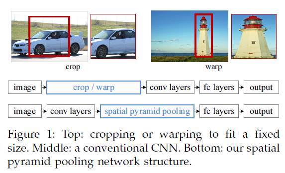
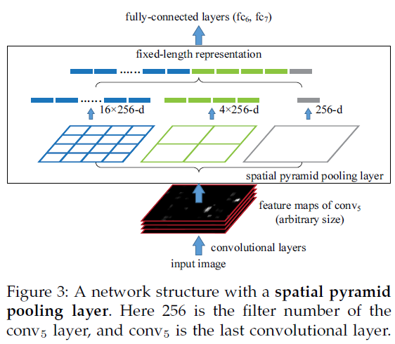

# Spatial Pyramid Pooling in Deep Convolutional Networks for Visual Recognition

我们知道在现有的CNN中，对于结构已经确定的网络，需要输入一张固定大小的图片，比如224*224，32*32,96*96等。这样对于我们希望检测各种大小的图片的时候，需要经过裁剪，或者缩放等一系列操作，这样往往会降低识别检测的精度，于是paper提出了“空间金字塔池化”方法，这个算法的牛逼之处，在于使得我们构建的网络，可以输入任意大小的图片，不需要经过裁剪缩放等操作，只要你喜欢，任意大小的图片都可以。不仅如此，这个算法用了以后，精度也会有所提高，总之一句话：牛逼哄哄。

既然之前的CNN要求输入固定大小的图片，那么我们首先需要知道为什么CNN需要输入固定大小的图片？CNN大体包含3部分，卷积、池化、全连接。

首先是卷积，卷积操作对图片输入的大小会有要求吗？比如一个5*5的卷积核，我输入的图片是30*81的大小，可以得到(26,77)大小的图片，并不会影响卷积操作。我输入600*500，它还是照样可以进行卷积，也就是卷积对图片输入大小没有要求，只要你喜欢，任意大小的图片进入，都可以进行卷积。

池化：池化对图片大小会有要求吗？比如我池化大小为（2，2）我输入一张30*40的，那么经过池化后可以得到15*20的图片。输入一张53*22大小的图片，经过池化后，我可以得到26*11大小的图片。因此池化这一步也没对图片大小有要求。只要你喜欢，输入任意大小的图片，都可以进行池化。

全连接层：既然池化和卷积都对输入图片大小没有要求，那么就只有全连接层对图片结果又要求了。因为全连接层我们的连接劝值矩阵的大小W，经过训练后，就是固定的大小了，比如我们从卷积到全连层，输入和输出的大小，分别是50、30个神经元，那么我们的权值矩阵（50,30）大小的矩阵了。因此空间金字塔池化，要解决的就是从卷积层到全连接层之间的一个过度。

所以本文的贡献主要在此：

也就是说在以后的文献中，**一般空间金子塔池化层，都是放在卷积层到全连接层之间的一个网络层**。

空间金字塔池化的具体操作如下：

转自：http://blog.csdn.net/hjimce/article/details/50187655
