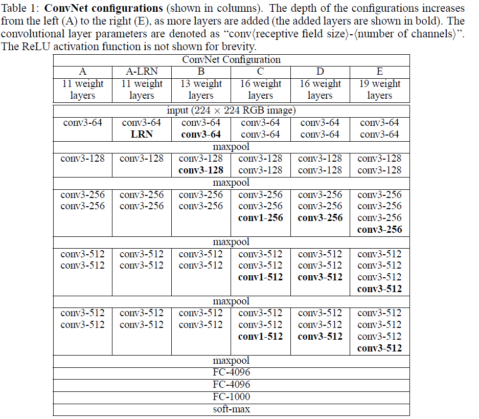
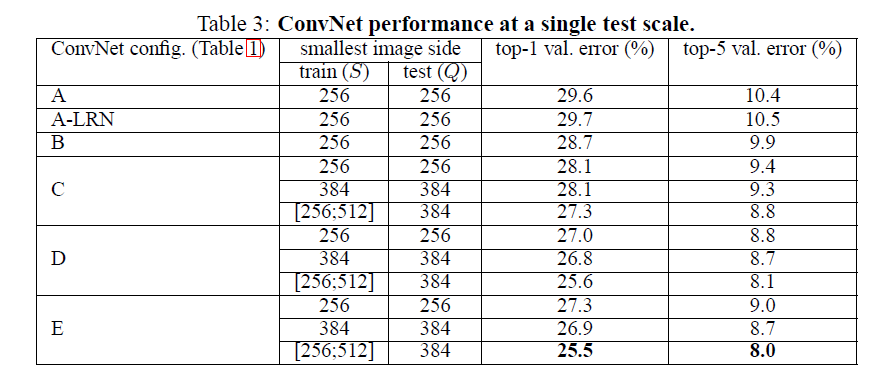
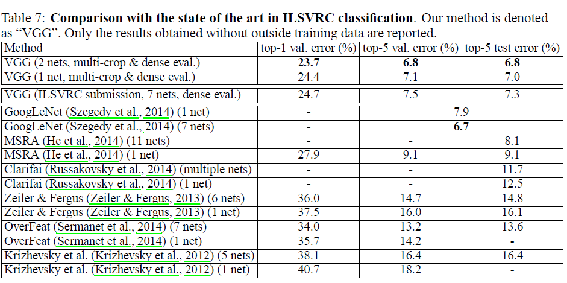

# VERY DEEP CONVOLUTIONAL NETWORKS

## Abstract

本篇论文我们主要探究卷积神经网络的深度对于大规模图像识别准确性的作用。本文主要的贡献在于通过增加大量使用3乘3卷积的网络层数（16-19层），来达到相比以前工作性能的大幅提高。

## Introduction
卷积神经网络近年来在大规模图像和视频识别中取得了巨大的成功，这归功于大规模图片数据集的公开以及高性能的计算系统的开发。

随着卷积神经网络在计算机视觉领域应用的增多，人们做了很多尝试，去提高原始AlexNet的性能。和以前的尝试不同，本论文中我们尝试着增加网络的***层数***来提高神经网络的性能。

## Convnet Configurations
为了说明网络层数的增加对性能的影响，我们的卷积网络的设计遵照alexnet的设计准则

### Architecture
在训练中，卷积神经网络的输入大小为224 × 224 RGB图片，唯一做的图片预处理是减掉均值(分别计算图片集上的每一个像素的均值)。预处理之后的图片被送入卷积层，我们使用非常小的3 × 3卷积核(能捕捉前后左右信息的最小单位)。我们也用1 × 1卷积核，他可以看做是对输入channels做线性变换。卷积的stride为1，padding也为1.max-pool仅在指定的卷积层之后做，2 × 2 pixel window, with stride 2。

一系列卷积层之后是三层全连接层，前面两层全连接层都是4096个channles，最后一层全连接层由于是需要分1000类，所以为1000个channels，第三层全连接层后接softmax层。

所有的隐藏层用的激活函数都为ReLU，在本文中我们不用Local Responose Normalisation，因为我们通过实验发现LRN并没有提高模型的性能，反而徒增gpu显存占用和计算时间。

### Configurations
卷积层的设计入表1所示,卷积层的宽度非常小(channel的数量)，从64开始，每经过一次pooling，增加一倍直到512为止。

### Discussion
和以前的卷积神经网络第一层用11×11和7×7卷积不同的是，我们仅仅用了3×3卷积。显而易见的是两层3×3卷积等效于一层5×5卷积，3层等效于一层7×7卷积。但是相比于一层7×7卷积，3层3×3卷积首先引入了更多的非线性，其次，减少了模型的参数，假设输入和输出均为C个channles，那么3层3×3卷积的参数个数为为27C^{2},而一层7×7卷积，则需要49C^{2}个参数，这个可以看做是对7×7卷积的一个正则约束。

1×1卷积是用来增加非线性的。在我们的设计中1×1卷积可以看成是一个线性变换，但同时他又引入了非线性。

##Classification Framework
在之前的章节中，我们阐述了网络的细节，在这节中，我们讨论训练和测试的细节。

### Training
卷积网络的训练大致和Alexnet相同，训练是通过SGD来优化多维逻辑回归目标函数，batch_size=256。

正则化有两项：

1：L2范数惩罚权重，系数为5e-4。

2:前两面层全连接层用dropout，概率系数为0.5。

learning rate 一开始设置为1e-2，直到validateion set的准确率不在提高，将learning rate缩小10倍，总共缩小3次之后，也就是迭代了370K次，74epochs之后收敛了。

模型的权重初始化非常重要(有了BN之后似乎并不是那么重要)，因为不好的初始化会导致网络梯度的不稳定。为了解决这个问题，我们首先随机初始化并训练浅层网络A(如表1所示)。然后将浅层网络训练好的参数初始化给高层网络中。

图像尺寸的最小边选择有以下几个方案：

1、固定大小S(最小边的长度)。在本论文的实验中我们采取了s=256和s=384两种方案，首先训练s=256的，然后在此基础上fine-tune得到s=384的。

2、S是可变长的。每一张图片随机rescale到一个S_{min}到S_{max}之间的一个数，这是有一定道理的因为测试数据集中图片的尺寸也是随机的。当然这也可以看成是一种数据扩增的一种手段。
这种变长尺寸的网络训练，可以通过fine-tune scale=384的网络得到

注意：这里rescale之后的图片需要经过crop成统一大小的224×224再进入卷积网络进行训练

##Classification Experiments

###Single Scale Evaluation
这里测试的尺寸取定值,且Q=S，测试结果如下图所示

由此得出结论：

1. LRN并没啥卵用。
2. 分类错误率随着模型深度的增加减小。
3. 在训练的时候，scale jittering能够提高模型的精度。

###Comparison with state of the art
对比如下图所示

##Conclusion
本篇论文主要贡献就是说明了卷积神经网络的深度对于效果的重要性。